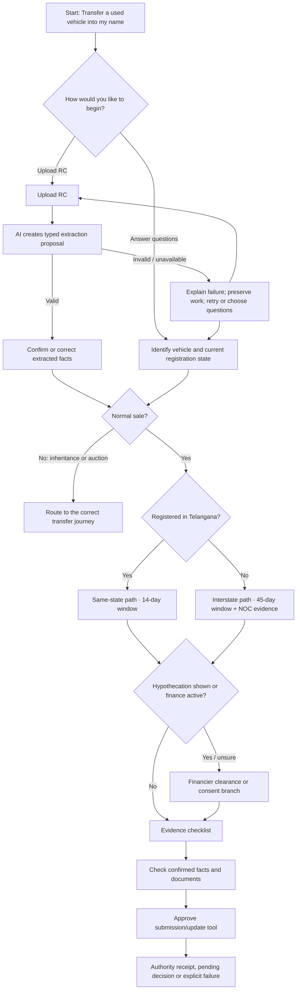

# AI-assisted, graph-constrained intake for a used-vehicle ownership transfer

_Research date: 26 August 2026. Scope: first-party government guidance and official Vercel AI SDK documentation only._

## Conclusion

The strongest production pattern is **not an open-ended AI agent that invents a journey**. It is a fixed, versioned ownership-transfer graph with an AI assistance layer inside individual nodes:

1. A journey-specific start page sets expectations and opens the correct graph.
2. The user can upload the RC and supporting documents first.
3. AI extracts a typed proposal, but the user confirms or corrects every material fact.
4. The graph engine—not the model—decides which nodes are active and which transitions are legal.
5. The model receives only the schemas, transition IDs and tools allowed at the current node.
6. Any state-changing or external-service tool requires explicit confirmation.
7. If AI output is missing, invalid or unavailable, show a plain failure state, preserve the user's work and offer retry or a user-chosen question flow. Do not silently substitute guessed or keyword-derived values.

This combines the government-service principles of focused pages, relevant branching, answer checking and resumability with the AI SDK's schema validation, tool allow-listing and approval controls.

## What the official service requires

For a normal used-vehicle ownership transfer in Telangana, the transferor reports the transfer in Form 29. The transferee applies in Form 30 with the registration certificate, insurance certificate, pollution-under-control certificate and prescribed fee. An interstate case adds the NOC/equivalent-evidence branch. [Telangana Transport Department — normal ownership transfer](https://www.transport.telangana.gov.in/html/registration-ownershiptransfer-normal.html)

National Parivahan guidance distinguishes normal sale, death of the owner and public auction as separate transfer routes; these should not be collapsed into a single generic form. It states a 14-day transferee window for a same-state transfer and 45 days for a vehicle registered outside the state. [Parivahan — transfer of ownership](https://mparivahan.parivahan.gov.in/mstatic/english/rc-info-ownership.html)

Forms are first-party evidence of the data and signatures needed by the legal process: [Form 29](https://parivahan.gov.in/parivahan/sites/default/files/DownloadForm/form%2029.pdf), [Form 30](https://parivahan.gov.in/parivahan/sites/default/files/DownloadForm/cmvr/FORM-30.pdf), and the [Parivahan forms catalogue](https://parivahan.gov.in/parivahan/en/content/download-forms). A financed vehicle also needs a hypothecation gate rather than an assumption that the sale path is immediately clear. [Parivahan — hypothecation termination](https://mparivahan.parivahan.gov.in/mstatic/english/rc-info-hp-termination.html)

These official requirements define the graph. AI may reduce typing and explain what is happening; it must not redefine the statutory path or represent approval as guaranteed.

## Government interaction patterns to adopt

| Need | First-party guidance | Product implication |
|---|---|---|
| One focused decision at a time | GOV.UK says to start with one thing per page: one piece of information, decision or question. This aids focus, mobile use, error recovery, autosave, analytics and branching. [Structuring forms](https://www.gov.uk/service-manual/design/form-structure) and [Question pages](https://design-system.service.gov.uk/patterns/question-pages/) | After document review, ask only the next unresolved graph question. Do not expose every transfer field at once. Keep Back, Continue and saved state. |
| Adaptive questions | GOV.UK advises branching so people answer only questions relevant to them and recommends testing early eligibility/routing questions. [Structuring forms](https://www.gov.uk/service-manual/design/form-structure) | The answer to “Where is the vehicle registered?” activates same-state or interstate evidence. “Is finance shown on the RC?” activates the hypothecation branch. |
| Journey-specific entry | A government service start point should say what the service does, use a name matching the user's problem, list needed documents/information, and avoid placing complex eligibility rules on the start page. [Start using a service](https://design-system.service.gov.uk/patterns/start-using-a-service/) | Enter through **Transfer a used vehicle into my name**, not a generic “Buying a vehicle” chat. Show likely documents, timing and that final acceptance is by the transport authority. |
| Document upload | GOV.UK says to request an upload only when it is critical, give specific errors, and let users reuse an uploaded file within the journey. [File upload](https://design-system.service.gov.uk/components/file-upload/) | Make RC upload the preferred acceleration path, not a mandatory AI gimmick. Reuse it for vehicle identity, registration state and hypothecation evidence. Explain accepted formats, size and privacy before upload. |
| Confirm extracted facts | Government services should let people check answers before information is submitted, with a way to change each answer. [Check answers](https://design-system.service.gov.uk/patterns/check-answers/) | Present extracted facts as a proposal: registration number, registered owner, make/model, registration state and finance marker. Each item needs **Confirm** or **Change**; no fact becomes authoritative merely because the model returned it. |
| Useful uncertainty | GOV.UK question pages say to permit “I do not know” or “I'm not sure” when those are valid responses. [Question pages](https://design-system.service.gov.uk/patterns/question-pages/) | An unreadable hypothecation field becomes `unresolved`, leading to a focused question or clearer-document request—not a guessed `false`. |
| Graceful failure | For unexpected service problems, GOV.UK says to explain that there is a problem, say what happened to saved answers, give a useful next route and preserve data so the journey can resume. [There is a problem with the service](https://design-system.service.gov.uk/patterns/problem-with-the-service-pages/) | Say “We could not read this document. Nothing was added.” Preserve the upload safely, offer retry/remove/upload another file, and offer the normal question flow. Do not expose provider jargon or manufacture a result. |

A live first-party production precedent supports the specific-entry approach: the UK DVLA page is titled around the exact event (“sold, transferred or bought a vehicle”), says what the transaction changes, makes possession of the registration document an early gate, supplies another route when it is missing, and explains consequential next steps. The Indian rules differ, but this is useful interaction evidence for entering the correct statutory route before asking questions. [DVLA — tell DVLA you sold, transferred or bought a vehicle](https://www.gov.uk/sold-bought-vehicle)

The GOV.UK Service Manual's 2025 AI guidance adds a trust obligation: AI should be used only for an evidenced user need; users must be told how it may affect their data or outcome; AI-provided information must be accurate; services must protect against bias, be explainable by the team, involve security professionals, and be continuously monitored. [Using AI in services](https://www.gov.uk/service-manual/technology/using-artificial-intelligence-ai-in-services) For this journey, the practical disclosure is short and concrete: “AI will read this document to suggest details. You will check them before anything is saved or sent.”

## Recommended citizen flow



### Page sequence

1. **Start** — “Transfer a used vehicle into my name”; what the service does, documents likely needed, 14/45-day timing, cost caveat, and link to the official service.
2. **Choose how to begin** — upload RC or answer questions. Upload is an accelerator, not the only entrance.
3. **Upload and processing** — visible file state; do not advance until a validated extraction result exists.
4. **Confirm vehicle facts** — short summary list with source thumbnail/page reference and Change actions.
5. **Ask unresolved routing gates** — one per page: transfer route, current registration state, finance/hypothecation.
6. **Evidence checklist** — Forms 29/30, RC, insurance, PUC, fee; add NOC or financier evidence only when its branch is active.
7. **Review** — distinguish user-confirmed facts, uploaded evidence, unresolved items and authority-verified data.
8. **Approve action** — preview exactly what will be written or sent. Approval is separate from document-fact confirmation.
9. **Outcome** — receipt/reference and pending status; never label the legal transfer complete until the authority result says so.

The outcome should be a durable receipt rather than a generic success toast. Government confirmation-page guidance calls for a reference number where available, what happens next and when, contact information, relevant next services, and a way to save the transaction record. [GOV.UK confirmation pages](https://design-system.service.gov.uk/patterns/confirmation-pages/)

## Constraining Vercel AI SDK to the graph

The repository currently declares `ai` `^7.0.78`; API details should be verified against that installed version during implementation. The official SDK documentation supports each required control:

- A user message can contain `FilePart` or `ImagePart` input. File support varies by provider/model, and MIME type must be supplied. [AI SDK prompts — file parts](https://ai-sdk.dev/docs/foundations/prompts) and [`generateText`](https://ai-sdk.dev/docs/reference/ai-sdk-core/generate-text)
- `Output.object({ schema })` validates generated structured output; invalid/missing output can raise `NoObjectGeneratedError`. `Output.json()` is insufficient because it checks JSON syntax but not the required shape. [AI SDK `Output`](https://ai-sdk.dev/docs/reference/ai-sdk-core/output)
- Tool `inputSchema` validates calls; `strict: true` asks supporting providers for strict tool calls. `activeTools` and `toolChoice` can limit or force the tools available at a step. [AI SDK tools and tool calling](https://ai-sdk.dev/docs/ai-sdk-core/tools-and-tool-calling)
- `needsApproval` creates a two-stage approval flow before a sensitive server-side tool executes. [AI SDK tool execution approval](https://ai-sdk.dev/docs/ai-sdk-core/tools-and-tool-calling#tool-execution-approval) and [AI SDK UI approval](https://ai-sdk.dev/docs/ai-sdk-ui/chatbot-tool-usage#tool-execution-approval)
- `stopWhen` bounds multi-step execution, while tool failures and schema errors are observable and can be handled explicitly. [AI SDK tool calling](https://ai-sdk.dev/docs/ai-sdk-core/tools-and-tool-calling) and [error handling](https://ai-sdk.dev/docs/ai-sdk-core/error-handling)

### Recommended boundary

```text
Graph engine (authoritative)
  loads current journey revision + active node
  derives allowed fact keys, transition IDs, and tools
             ↓
AI extraction (assistive)
  receives the document plus a node-specific Output.object schema
  returns proposed facts + evidence locations + unresolved fields
             ↓
User confirmation (authoritative for user-supplied facts)
  confirms/changes facts; no mutation tool runs yet
             ↓
Graph transition validator (authoritative)
  checks current node, graph revision, guards, subject and idempotency key
             ↓
Approved tool (authoritative side effect)
  only the active-node tool is exposed; user approves its exact inputs
             ↓
External result (authoritative for service status)
  receipt/pending/rejected/approved updates the graph
```

### Node-scoped extraction contract

The schema should allow only facts the active node can consume. For an RC-upload node, that means an enum-constrained document type and a closed set of fields such as `registrationNumber`, `registeredOwnerName`, `registrationState`, `makeModel` and `hypothecationStatus`. Each field should carry a value or `unresolved` plus an evidence location (page/region). It should not contain an arbitrary next-node string or a generic database update command.

If the model is asked to suggest a transition, expose only `allowedTransitionIds` derived from the current graph as a schema enum. The server must still re-evaluate the transition guard after confirmation. Unknown fields, unknown transition IDs, stale graph revisions and unresolved mandatory gates are rejected rather than repaired into guessed business facts.

### Tool boundary

Use narrow tools such as:

- `saveConfirmedVehicleFacts`
- `recordEvidenceAttachment`
- `createOwnershipTransferDraft`
- `submitOwnershipTransfer` (or a synthetic equivalent)

Do not give the model a generic `updateJourney`, SQL or arbitrary node-completion tool. For each generation step, derive `activeTools` from the current node. Require `needsApproval: true` for state changes and external submissions. The tool independently validates the subject, active node, confirmed evidence, transition guard and idempotency key.

This preserves “AI for language/document understanding” without making the model the workflow engine.

## Failure and trust states

| Condition | Required UI behavior | State behavior |
|---|---|---|
| Provider timeout/unavailable | “We could not read the document right now. Nothing was added.” Retry and alternate-entry actions. | Keep the node active; persist the upload reference according to the stated retention policy. |
| No structured object | Same plain failure language; optionally ask for a clearer image/PDF. | Do not partially apply model text. Log `NoObjectGeneratedError` internally. |
| Unsupported/password-protected/oversize file | Specific file error before model execution. | No extraction attempt; user can replace the file. GOV.UK publishes specific wording for these cases. |
| Some fields unreadable | Show readable proposals and mark the rest “Could not read”. | Only confirmed fields become user facts; unresolved fields drive focused questions. |
| Invalid tool call/unknown transition | Do not auto-repair into a different legal action. Say the assistant could not continue. | Reject call; active node and confirmed data remain unchanged. |
| External transport service rejects/fails | Clearly distinguish rejected, pending and unavailable. Show receipt/reason where supplied. | External result controls status; AI wording cannot mark the transfer completed. |

## Minimum production tests

Vercel documents repeatable unit testing with `MockLanguageModelV3`, `mockValues` and simulated streams. [AI SDK testing](https://ai-sdk.dev/docs/ai-sdk-core/testing)

Test at least:

- valid RC extraction followed by confirmation;
- two owners or ambiguous names never silently collapse into one person;
- unreadable hypothecation becomes `unresolved`, never `false`;
- same-state versus interstate activation and their 14/45-day information;
- inheritance/auction language routes away from the normal-sale graph;
- unknown fact keys and unknown transition IDs fail schema/graph validation;
- stale graph revision and duplicate idempotency key cannot advance twice;
- no mutation happens before confirmation and tool approval;
- provider timeout, no object, malformed tool call and external-service failure preserve state;
- Back/Resume returns to the same confirmed answers and active node;
- uploaded RC can be reused within this journey without a second upload;
- accessibility checks for keyboard upload, visible error summary, focus movement and status announcements.

For production observability, the SDK offers OpenTelemetry-based telemetry, but its telemetry API is documented as experimental. Inputs and outputs can be excluded from recording—important for RC and identity data. [AI SDK telemetry](https://ai-sdk.dev/docs/ai-sdk-core/telemetry)

## Sources

### Government service and design

- [Telangana Transport Department — normal ownership transfer](https://www.transport.telangana.gov.in/html/registration-ownershiptransfer-normal.html)
- [Parivahan — transfer of ownership](https://mparivahan.parivahan.gov.in/mstatic/english/rc-info-ownership.html)
- [GOV.UK Service Manual — structuring forms](https://www.gov.uk/service-manual/design/form-structure)
- [GOV.UK Design System — question pages](https://design-system.service.gov.uk/patterns/question-pages/)
- [GOV.UK Design System — start using a service](https://design-system.service.gov.uk/patterns/start-using-a-service/)
- [GOV.UK Design System — file upload](https://design-system.service.gov.uk/components/file-upload/)
- [GOV.UK Design System — check answers](https://design-system.service.gov.uk/patterns/check-answers/)
- [GOV.UK Design System — problem with the service](https://design-system.service.gov.uk/patterns/problem-with-the-service-pages/)
- [GOV.UK — DVLA vehicle transfer start page](https://www.gov.uk/sold-bought-vehicle)
- [GOV.UK Service Manual — using AI in services](https://www.gov.uk/service-manual/technology/using-artificial-intelligence-ai-in-services)
- [GOV.UK Design System — confirmation pages](https://design-system.service.gov.uk/patterns/confirmation-pages/)

### Vercel AI SDK

- [Prompts and file parts](https://ai-sdk.dev/docs/foundations/prompts)
- [`generateText`](https://ai-sdk.dev/docs/reference/ai-sdk-core/generate-text)
- [Structured `Output`](https://ai-sdk.dev/docs/reference/ai-sdk-core/output)
- [Tools and tool calling](https://ai-sdk.dev/docs/ai-sdk-core/tools-and-tool-calling)
- [Error handling](https://ai-sdk.dev/docs/ai-sdk-core/error-handling)
- [Testing](https://ai-sdk.dev/docs/ai-sdk-core/testing)
- [Telemetry](https://ai-sdk.dev/docs/ai-sdk-core/telemetry)
