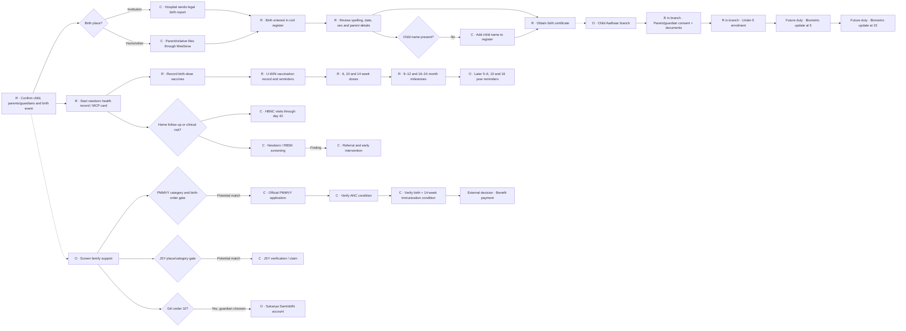
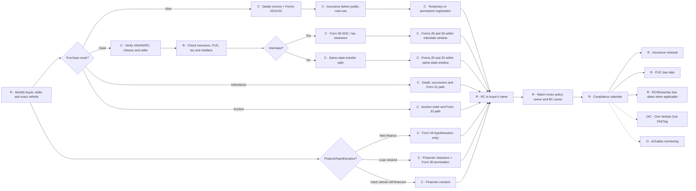
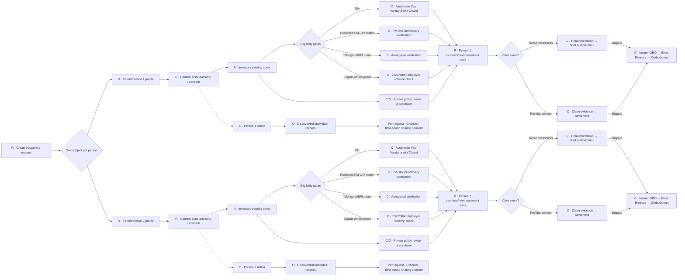
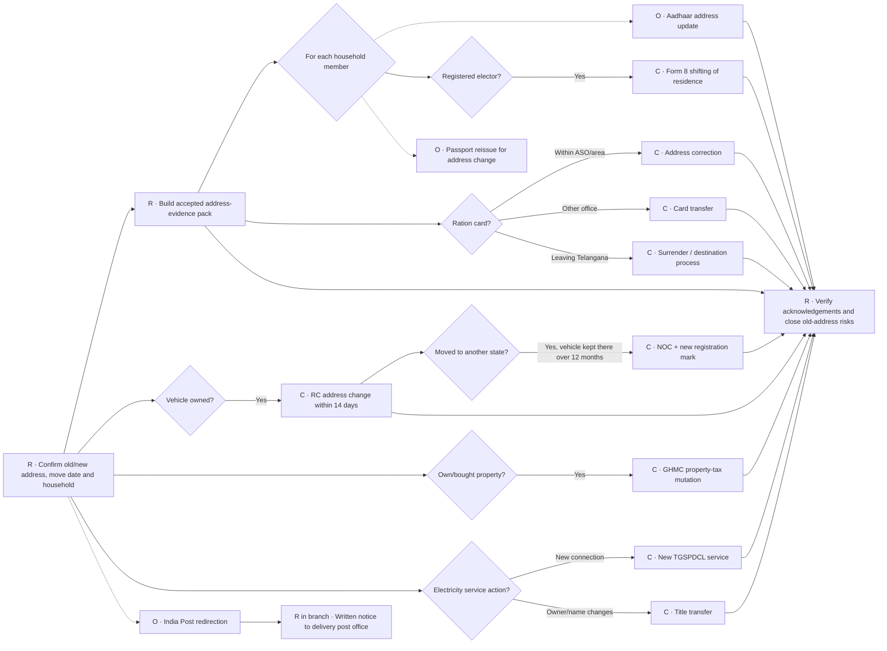
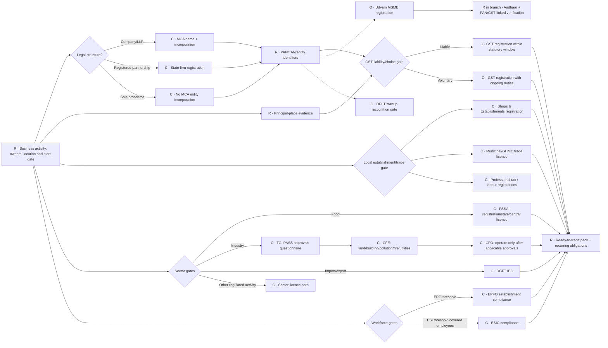
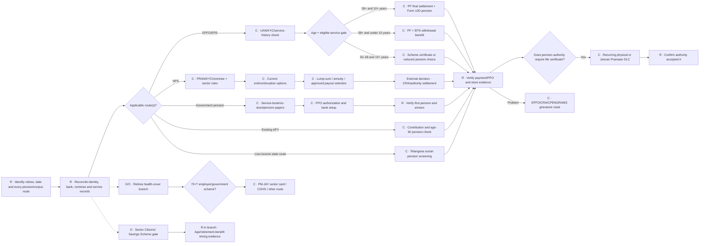

# Expanding UMANG journeys into real government-service graphs

**Research date:** 26 August 2026  
**Geographic assumption:** India-wide central services, with Telangana and Greater Hyderabad services where the service is state or local.  
**Source policy:** Primary sources only: Acts and rules, Union and Telangana government departments, statutory regulators, and official service portals.

## Executive conclusion

The current graphs are too simple for a realistic evaluation. They model five or six screens, while the real journeys are **conditional dependency graphs** whose shape changes with the citizen, asset, location, entitlement, and event.

The richer product should not show every possible service as one intimidating checklist. It should:

1. establish who or what the journey is about;
2. ask a small number of high-value routing questions;
3. activate only the applicable branches;
4. make the complete graph available on demand;
5. distinguish required, conditional, and optional work;
6. represent evidence, applications, external decisions, outputs, deadlines, and recurring duties as different things; and
7. never turn an eligibility screen into a promise of benefit.

The most important modeling correction is person scope. “Get insurance for my parents” describes at least three actors: the user who is helping and two separate insured people. Each parent needs an individual eligibility, consent, coverage, and claim-readiness subgraph. A household-level journey may group the work, but must not merge the people’s records or infer that the user is the patient.

## What “all government services” can realistically mean

There is no safe, permanent list of every applicable government service to embed in these six templates. The official service universe is already much larger and changes continuously:

- [UMANG](https://web.umang.gov.in/landing) is the Union government's cross-department gateway for central, state, local-body, utility, document, scheme and transaction services. Its official e-book describes more than 2,100 services from more than 200 departments.
- [ServicePlus](https://serviceonline.gov.in/?language=en) currently reports more than 4,700 launched services across all 36 states and union territories, spanning statutory, regulatory, developmental and consumer-utility services.
- [myScheme](https://search.myscheme.gov.in/) is the official eligibility-based discovery layer for central and state/UT schemes; it is the right source for discovering possible benefits, not evidence that a citizen is approved.
- [Telangana MeeSeva](https://ts.meeseva.telangana.gov.in/TSDeptPortal/UserInterface/Services.html) is the state service catalogue for certificates, registrations, revenue, food-security, municipal and other department workflows, including published category and SLA data.

Accordingly, “all” should mean **all applicable service families for this citizen's selected outcome and jurisdiction**, discovered from monitored official registries and then reduced by routing gates. The static templates below are researched baseline packs for Telangana/Greater Hyderabad, not a claim that every Indian department's service is permanently covered.

### Legend used below

- **R — Required:** required to complete the selected journey outcome, not necessarily imposed on every citizen by law.
- **C — Conditional:** the branch appears only when its gate is true. After a citizen activates or qualifies for that branch, its required children become mandatory for that branch.
- **O — Optional:** a useful government service or preparation step the citizen may choose.
- **External decision:** a government department, insurer, or authority—not UMANG—decides the outcome.

## Cross-journey model the product needs

The product should model these independently instead of reducing everything to a step status:

| Concept | Why it matters |
|---|---|
| Subject | The person, child, vehicle, property, or enterprise that the service concerns. |
| Actor | The person doing the work. An actor can help a parent or child without becoming the subject. |
| Authority/consent | Why the actor may submit or access the subject’s data. Health-record sharing must remain consent-aware. |
| Context gate | Answers such as new/used vehicle, interstate move, food business, age 70+, or institutional birth that determine which branch exists. |
| Evidence item | A document or verified record with issuer, subject, dates, extraction confidence, and verification state. |
| Service case | One application to one authority, with reference number and its own state machine. |
| External decision | Submitted, acknowledged, under review, clarification required, approved, rejected, or expired. |
| Output | Certificate, updated register, policy, card, registration number, licence, payment, or appointment. |
| Obligation | A deadline or recurring duty such as a vaccine dose, insurance renewal, filing, or life certificate. |
| Branch activation | Optional/conditional branches are dormant until selected or made applicable; activated children can then contain mandatory nodes. |

The graph engine should also support **alternative satisfaction paths**. For example, a hospital can report an institutional birth, while a parent reports a home birth through a different evidence route. These paths converge at the registered birth entry.

---

# 1. Having a Baby

## Routing questions

Ask only what changes the graph:

- Where did the birth occur: hospital/institution or home/other place?
- Is the birth already present in the local civil register?
- Has the child been named in the register?
- Was the baby premature, low birth weight, unwell, or referred for follow-up?
- Does the caregiver want public-program follow-up and immunization tracking?
- Does the family want Aadhaar for the child?
- Does the mother appear to meet a benefit category for PMMVY or JSY?
- Is the child a girl and does a guardian want to explore Sukanya Samriddhi?

## Proposed dependency graph

## Service detail and evidence

| Node or gate | Classification | Prerequisite and likely evidence | Output / timing | Official source |
|---|---|---|---|---|
| Institutional birth report | C | Birth at a hospital; hospital Form 1/legal information | GHMC says hospitals submit the legal birth form within 7 days and the request goes online to the registrar | [GHMC Birth and Death service](https://ghmc.gov.in/Birth.aspx) |
| Home/other-place report | C | Informant, Form 1 and supporting documents through MeeSeva | Registered entry, subject to registrar verification | [GHMC Birth and Death service](https://ghmc.gov.in/Birth.aspx) |
| Delayed registration | C | Delay after prescribed period; late fee, written permission and documents vary by age of delay | Under amended section 13: within 30 days with late fee; after 30 days but within one year with written permission and self-attested document; after one year on order of the specified magistrate | [Registration of Births and Deaths Act, section 13](https://www.indiacode.nic.in/show-data?abv=DL&actid=AC_CEN_5_40_00006_196918_1517807324141&orderno=13&orgactid=AC_DL_64_817_00002_00002_1548911142400&statehandle=123456789%2F2493) |
| Review/correction | R | Registered entry and supporting facts | Corrected register/certificate only after authority approval | [GHMC birth-registration FAQ](https://www.ghmc.gov.in/faq_births.aspx), [GHMC application forms](https://www.ghmc.gov.in/CSC_ApplicationForms.aspx) |
| Birth certificate | R | Registered birth | Download/request certificate through GHMC/MeeSeva | [GHMC Birth and Death service](https://ghmc.gov.in/Birth.aspx) |
| MCP/child health record | R for this journey design | Mother/child identity and birth details | Longitudinal paper health and immunization record; the card includes birth registration, RCH ID and vaccination fields | [Official Mother and Child Protection Card](https://www.nhm.gov.in/New_Updates_2018/NHM_Components/Immunization/Guildelines_for_immunization/MCP_Card_English_version.pdf), [MCP guide](https://nhm.gov.in/New_Updates_2018/NHM_Components/Immunization/Guildelines_for_immunization/MCP_Guide_Book.pdf) |
| Vaccination timeline | R for health branch | Date of birth and prior doses | Schedule at birth; 6, 10, 14 weeks; 9–12 months; 16–24 months; and later milestones. Hepatitis-B birth dose is specified within 24 hours and OPV-0 within 15 days | [MoHFW National Immunization Schedule](https://www.mohfw.gov.in/sites/default/files/National%20Immunization%20Schedule.pdf) |
| U-WIN tracking | R for digital vaccination branch | Beneficiary registration and administered dose record | Appointment/reminders and QR e-vaccination certificate after vaccination | [MoHFW U-WIN update, February 2026](https://www.pib.gov.in/PressReleasePage.aspx?PRID=2227422&lang=1&reg=3), [official U-WIN self-registration SOP](https://uwindashboard.mohfw.gov.in/assets/pdf/Self_Registration_Module_U-WIN_SOP_v2_Apr_2024-1.pdf) |
| HBNC | C | Public-program availability; extra attention for home birth, preterm, low-birth-weight or sick babies | ASHA visits through day 42; official schedule includes days 3, 7, 14, 21, 28 and 42, with additional visit(s) in relevant cases | [NHM HBNC/HBYC resources](https://nhm.gov.in/index1.php%3Flang%3D1%26level%3D1%26sublinkid%3D1416%26lid%3D769), [HBNC operational guideline](https://nhm.gov.in/images/pdf/communitisation/asha/Orders-Guidelines/HBNC_Operational_Guidelines_English.pdf) |
| Newborn/RBSK screening | C | Child health contact; finding determines referral | Screening for birth defects/diseases/deficiencies/developmental delay and, if indicated, referral to early intervention | [NHM RBSK 2.0](https://nhm.gov.in/index1.php?lang=1&level=0&lid=773&linkid=499), [2026 child-health guidelines](https://nhm.gov.in/index4.php?lang=1&level=0&lid=825&linkid=521) |
| JSSK care | C | Public health institution or eligible sick infant pathway | Free specified delivery/newborn/infant services and transport; it is an entitlement pathway, not cash promised by UMANG | [NHM JSSK](https://www.nhm.gov.in/collections/index1.php?lang=1&level=3&lid=308&sublinkid=842) |
| Child Aadhaar | O | Child and parent/legal guardian visit; demographic details, guardian authentication/consent, and accepted relationship/date-of-birth documents | Aadhaar enrolment; under-5 enrolment captures photo, not the full child biometric set. Later biometric updates at age 5 and 15 | [UIDAI enrolling children FAQ](https://www.uidai.gov.in/en/contact-support/have-any-question/299-faqs/enrolment-update/enrolling-children.html), [UIDAI update rules](https://www.uidai.gov.in/en/my-aadhaar/about-your-aadhaar/updating-data-on-aadhaar.html), [2026 enrolment/update regulation](https://uidai.gov.in/images/Aadhaar_Enrolment_and_Update_First_Amendment_Regulations_2026_pdf.pdf) |
| PMMVY | C | Applicant must meet at least one published category and the applicable first/second-child rules; requires official registration and condition verification | The official FAQ describes ₹5,000 for the first child in two instalments and ₹6,000 for the second child if a girl, tied to pregnancy/ANC/birth/immunization conditions. Treat all amounts and eligibility as authority-verified | [PMMVY official FAQ](https://www.spniwcd.wcd.gov.in/pradhan-mantri-matru-vandana-yojna/faqs), [PMMVY documents and current notices](https://www.spniwcd.wcd.gov.in/pradhan-mantri-matru-vandana-yojna/documents) |
| JSY | C | Telangana is a high-performing state for this scheme; the published route covers BPL/SC/ST women at government facilities and BPL/SC/ST women at accredited private institutions | Cash assistance only after scheme verification | [NHM Janani Suraksha Yojana](https://nhm.gov.in/nhm/index1.php?lang=1&level=3&lid=309&sublinkid=841) |
| Sukanya Samriddhi | O | Girl under 10, guardian, birth certificate, and guardian documents | Savings account in the girl’s name; not a welfare entitlement | [Sukanya Samriddhi Account Scheme, 2019](https://www.nsiindia.gov.in/writereaddata/SchemeRules/SukanyaSamriddhiAccountSchemeRule.pdf) |

### Product implication

The birth certificate must **not** block birth-dose vaccination or early newborn care. Civil registration and newborn health begin from the same birth event and proceed in parallel. The certificate should gate identity/financial branches that actually require it.

---

# 2. Buying a Vehicle

## Routing questions

- New vehicle, normal used-vehicle sale, inheritance, or public auction?
- Is the vehicle registered in Telangana or another state?
- Is it financed or still under hypothecation?
- Private or transport/commercial vehicle?
- Are RC, insurance, PUC, tax and challans current?
- Will it use toll roads requiring FASTag?

## Proposed dependency graph

## Service detail and evidence

| Node or gate | Classification | Prerequisite and likely evidence | Output / timing | Official source |
|---|---|---|---|---|
| New permanent registration | C | Form 20, sales certificate Form 21, road-worthiness Form 22, insurance, address proof, temporary registration if any, and Form 34 if financed | Application is required within 7 days of taking delivery, excluding journey time; if temporarily registered, apply before it expires | [Parivahan permanent registration](https://parivahan.gov.in/en/content/permanent-registration), [Form 20](https://parivahan.gov.in/sites/default/files/DownloadForm/cmvr/FORM-20.pdf) |
| Used-vehicle pre-check | R for used route | RC/VAHAN match, seller, chassis/engine, current insurance and PUC; state requirements can add tax clearance and other evidence | Evidence pack before money/transfer | [Telangana ownership-transfer requirements](https://www.transport.telangana.gov.in/html/registration-ownershiptransfer-normal.html), [Parivahan transfer guidance](https://mparivahan.parivahan.gov.in/mstatic/english/rc-info-ownership.html) |
| Pending challans | O but strongly recommended | Vehicle, challan or licence number | Official challan status and payment receipt | [MoRTH eChallan](https://echallan.parivahan.gov.in/index/check-challan-status) |
| Same-state normal transfer | C | Forms 29 and 30, RC, insurance, PUC, fee and state-specific evidence | Transferee application within 14 days | [Parivahan transfer guidance](https://mparivahan.parivahan.gov.in/mstatic/english/rc-info-ownership.html), [Telangana Form 29/30 route](https://www.transport.telangana.gov.in/html/registration-ownershiptransfer-normal.html) |
| Interstate normal transfer | C | Same transfer evidence plus Form 28 NOC or permitted substitute evidence, tax status and destination-state process | Transferee application within 45 days | [Parivahan transfer guidance](https://mparivahan.parivahan.gov.in/mstatic/english/rc-info-ownership.html), [Telangana NOC requirements](https://www.transport.telangana.gov.in/html/registration-noobjectioncertificate.html) |
| Inheritance transfer | C | Form 31, RC, insurance, death certificate, PUC and succession/legal-heir evidence as required | Successor must notify within 30 days and may use vehicle for up to three months before transfer; apply in Form 31 within that period | [Parivahan transfer guidance](https://mparivahan.parivahan.gov.in/mstatic/english/rc-info-ownership.html), [Telangana citizen charter](https://www.transport.telangana.gov.in/html/pdf/citizen-charter.pdf) |
| Auction transfer | C | Form 32, RC, insurance, auction sale certificate/order and applicable supporting records | Application within 30 days of possession | [Parivahan transfer guidance](https://mparivahan.parivahan.gov.in/mstatic/english/rc-info-ownership.html) |
| Hypothecation | C | Loan/finance gate; financier consent or clearance, RC, insurance and relevant Form 34/35 | Hypothecation entry, continuation or termination in RC | [Parivahan forms catalogue](https://parivahan.gov.in/parivahan/en/content/download-forms), [hypothecation termination guidance](https://mparivahan.parivahan.gov.in/mstatic/english/rc-info-hp-termination.html) |
| Motor insurance | R before driving | Vehicle and owner details, RC, previous policy/inspection as insurer requires | Third-party liability cover is mandatory on public roads. RC and insurance should use the same owner/address. Comprehensive/package ownership transfer must be recorded within 14 days or own-damage claims can fail | [IRDAI motor-insurance guide](https://irdai.gov.in/web/policy-holder/motor-insurance) |
| FASTag | C/O | Relevant vehicle, RC/vehicle verification and issuer KYC | One active FASTag per vehicle; issuer activation/KYC state | [IHMCL FASTag FAQ](https://ihmcl.co.in/faq/), [IHMCL circulars](https://ihmcl.co.in/circulars/) |
| Compliance calendar | R | Policy, PUC, RC, tax and fitness records appropriate to class | Reminders and verified renewal outputs; RC renewal is filed in Form 25 no more than 60 days before expiry | [Parivahan RC renewal](https://staging.parivahan.gov.in/parivahan/en/content/renewal-of-rc), [IRDAI documents-to-carry guidance](https://irdai.gov.in/web/policy-holder/motor-insurance) |

### Product implication

“Buying a vehicle” is not one linear transfer flow. The first fork—new, normal sale, inheritance, or auction—changes both forms and evidence. Interstate status and finance add branches that converge only when the RC and policy identify the same owner.

---

# 3. Health & Insurance

## Routing questions

- Who needs help? Create one subject per person, even when the request says “my parents.”
- Is the logged-in user the subject, a helper, or an authorized representative?
- For each person: age, state, employment/pensioner status, household scheme status, existing employer/private/public cover, and immediate-care need.
- Is this a planning journey, an active hospitalization, a reimbursement claim, or a grievance?
- Does the person consent to ABHA creation, record linking, and each sharing request?

## Proposed dependency graph

## Service detail and evidence

| Node or gate | Classification | Prerequisite and likely evidence | Output / timing | Official source |
|---|---|---|---|---|
| Subject and helper authority | R | Separate demographic/relationship record for every patient; authorization/consent where another adult is helping | Person-scoped case; no medical record or eligibility result is silently assigned to the logged-in helper | This is a product safety requirement supported by ABDM’s individual, consent-based record model: [ABDM architecture](https://abdm.gov.in/abdm), [ABDM FAQ](https://abdm.gov.in/FAQ) |
| Coverage inventory | R | Policy documents/CIS, employer card, scheme card, prior claims and renewal date for the individual | Normalized coverage record with gaps and uncertain fields, not a generic “insured” boolean | [IRDAI health-insurance guidance](https://irdai.gov.in/health-dept) |
| Ordinary PM-JAY verification | C | Official beneficiary search and identity/eKYC; ABHA alone does not establish eligibility | Authority-verified beneficiary/card status. Eligible families receive specified cashless cover at empanelled hospitals; do not promise eligibility from a language model | [NHA beneficiary letter](https://nha.gov.in/img/resources/Adhikar-Patra.pdf), [ABDM FAQ distinguishing ABHA and PM-JAY](https://abdm.gov.in/FAQ) |
| PM-JAY for people aged 70+ | C | Individual age 70+, Indian citizenship and Aadhaar eKYC/card process | Distinct senior-citizen card/coverage path. The official FAQ says eligibility is irrespective of income, but ₹5 lakh is family-based and already-covered 70+ members require eKYC for the additional top-up | [NHA senior-citizen FAQ](https://nha.gov.in/img/resources/English_FAQs_related_to_the_benefits_for_senior_citizens.pdf) |
| Telangana Aarogyasri | C | Telangana scheme verification and qualifying household/category; official portal describes BPL focus | Scheme/card or rejection/clarification from the Trust | [Aarogyasri Health Care Trust](https://aarogyasri.telangana.gov.in/) |
| ESIC | C | Covered employment/establishment and insured-person status; published wage ceiling is ₹21,000 per month, with rule-specific exceptions | ESIC insured-person/family medical-benefit route | [ESIC official FAQ](https://www.esic.gov.in/attachments/files/faq.pdf) |
| Private policy review | C/O | Proposal, health disclosures, policy, Customer Information Sheet, network list and renewal record | Explain sum insured, exclusions, room/ICU limits, waiting periods, co-pay, deductible, sub-limits, network and renewal. A purchase remains insurer-underwritten | [IRDAI health-insurance FAQ](https://irdai.gov.in/health-dept) |
| Portability | C/O | Existing policy, all members in family cover, renewal date | Request to new insurer. Official guidance says apply at least 30 and not earlier than 60 days before renewal; underwriting/acceptance remains with insurer | [IRDAI portability guidance](https://irdai.gov.in/health-dept) |
| Cashless readiness | R after cover chosen | Policy/card, insured ID, network hospital, diagnosis/admission documents and hospital preauthorization request | IRDAI’s published TAT is no more than 1 hour for cashless preauthorization and 3 hours for final discharge authorization | [IRDAI health-insurance FAQ](https://irdai.gov.in/health-dept) |
| Reimbursement claim | C | Claim form, policy/card, bills, prescriptions, discharge summary and insurer-specific evidence | Official published TAT for non-cashless settlement is 15 days, subject to a complete/admissible claim | [IRDAI health-insurance FAQ](https://irdai.gov.in/health-dept) |
| ABHA | O | The individual’s informed choice and authentication | Individual ABHA; it does not confer free treatment or PM-JAY eligibility | [ABDM citizens page](https://abdm.gov.in/citizens), [ABDM FAQ](https://abdm.gov.in/FAQ) |
| Link/share health records | O and per-record consent | ABHA/PHR and records discoverable at participating facilities; the person grants consent | Linked records and granular, time-bound access. Providers cannot access prior records without the person’s consent | [ABDM FAQ](https://abdm.gov.in/FAQ), [ABDM architecture](https://abdm.gov.in/abdm) |
| Insurance grievance | C | First complain to insurer/GRO with policy/claim and evidence | If unresolved or unsatisfactory, register and track through Bima Bharosa; Ombudsman can be a later path. Official FAQ says insurer should resolve within 15 days | [Bima Bharosa FAQ](https://bimabharosa.irdai.gov.in/Home/FAQ), [IRDAI grievance guidance](https://irdai.gov.in/igms1) |

### Product implication

A health journey is a **household container holding separate person graphs**. It should show “You are helping Meera” rather than asking Meera’s insurance questions as though they describe the logged-in user. Cover, ABHA, consent, claims and documents must remain scoped to one subject.

---

# 4. Moving Home

## Routing questions

- Who is moving, and which household members need individual updates?
- Renting, buying, moving into family accommodation, or another arrangement?
- Same locality, same state, or interstate?
- Does the household own vehicles, ration card, voter registrations, passports, or utilities at the old address?
- Is this also a property purchase requiring municipal mutation/title transfer?

## Proposed dependency graph

## Service detail and evidence

| Node or gate | Classification | Prerequisite and likely evidence | Output / timing | Official source |
|---|---|---|---|---|
| Address-evidence pack | R | Ownership/tenancy/family route; collect documents once and map them to each authority’s list rather than claiming one universal proof | Reusable evidence set with per-service acceptance | [UIDAI accepted-document examples](https://www.uidai.gov.in/en/921-faqs/aadhaar-online), [ECI Form 8](https://voters.eci.gov.in/formspdf/Form_8_English.pdf), [Passport Seva proof-of-address list](https://www.passportindia.gov.in/psp/ListDocuments) |
| Aadhaar address update | O | Registered mobile for online route, valid proof of address, or eligible Head-of-Family route with relationship proof and HoF approval | Service Request Number and updated Aadhaar if accepted; the address entered must match the uploaded proof | [UIDAI online address-update process](https://uidai.gov.in/en/contact-support/have-any-question/922-faqs/aadhaar-online-services/online-address-update-process.html), [UIDAI HoF address update](https://uidai.gov.in/en/1474-english-uk/faqs/your-aadhaar/aadhaar-app/19851-how-to-update-address-using-family-member-s-aadhaar.html) |
| Voter residence shift | C | Existing enrolled elector, EPIC if known, present ordinary residence, and self-attested accepted proof in self/parent/spouse/adult child’s name as Form 8 permits | Shifted electoral-roll entry and replacement EPIC after ERO approval | [ECI Form 8](https://voters.eci.gov.in/formspdf/Form_8_English.pdf), [Form 8 guidance](https://voters.eci.gov.in/guidelines/Form-8_en.pdf), [Voters’ Service Portal](https://voters.eci.gov.in/home/forms) |
| Passport address | O | Existing passport, proof of present address and application/appointment | Passport reissue for changed personal particulars/address; it is not a simple database toggle | [Passport Seva FAQ](https://www.passportindia.gov.in/psp/FaqApplicationForm), [reissue document advisor](https://services2.passportindia.gov.in/psp/docAdvisor/reissuePassport) |
| Telangana ration card | C | Existing card and move geography | Within-office modification, other-office transfer, or surrender when moving to another state. MeeSeva publishes different SLAs for each route | [Telangana MeeSeva service catalogue](https://ts.meeseva.telangana.gov.in/TSDeptPortal/UserInterface/Services.html) |
| RC address update | C | Form 33, RC, new-address proof, insurance, PUC and financier NOC if applicable | Apply within 14 days of address change | [Parivahan address-change guidance](https://mparivahan.parivahan.gov.in/mstatic/english/rc-info-address-change.html), [Telangana RC address service](https://www.transport.telangana.gov.in/html/registration-addresschange.html) |
| Interstate vehicle reassignment | C | Vehicle removed to another state, Form 27, Form 28 NOC, residence, insurance, PUC and tax | New registration mark; Telangana states that section 47 provides 12 months for reassignment | [Telangana RC address/reassignment service](https://www.transport.telangana.gov.in/html/registration-addresschange.html) |
| Property-tax mutation | C | Property purchase/transfer, PTIN, registered deed or succession evidence, tax status and local supporting documents | GHMC property-tax owner mutation; approval remains subject to documentation/tax status | [GHMC mutation form](https://www.ghmc.gov.in/CSC_Applications/Mutation_Transfer_of_Property.pdf), [GHMC mutation procedure](https://www.ghmc.gov.in/Property_Tax/Procedure_Online_Mutation.pdf) |
| Electricity connection/title transfer | C | New connection or changed title; property/lease evidence and utility-specific forms | TGSPDCL service connection or title transfer; charges and feasibility may depend on field verification/load | [TGSPDCL service portal](https://tgspdclwebportal.tgsouthernpower.org/), [TGSPDCL downloads and title-transfer forms](https://www.tgsouthernpower.org/downloads), [title-transfer evidence list](https://webportal.tgsouthernpower.org/TGSPDCL/LeftMenu/Downloads/title_doc.pdf) |
| Mail redirection | O | Written intimation to the concerned delivery post office with new address | Redirection instruction valid for no more than 3 months under the 2024 regulations | [Post Office Regulations, 2024, regulation 69](https://www.indiapost.gov.in/VAS/Pages/News/IP_19122024_Regulations.pdf) |

### Product implication

The move graph should fan out **per household member** for Aadhaar, voter and passport, while keeping ration card and property/utility actions at household or premises level. Interstate movement activates vehicle-NOC/reassignment and ration-card transfer/surrender branches; it should not make those visible for a move across the street.

---

# 5. Starting a Business

## Routing questions

- What activity will the business perform, and where?
- Sole proprietor, registered partnership, LLP, private company, cooperative, or other structure?
- Food, manufacturing, import/export, regulated professional service, or ordinary local trade?
- Expected turnover, interstate/e-commerce supply, and other GST triggers?
- Number of workers and wage bands?
- Pollution category, building height/use, fire risk, water/power needs, and machinery?
- Does the business want MSME or DPIIT startup recognition?

## Proposed dependency graph

## Service detail and evidence

| Node or gate | Classification | Prerequisite and likely evidence | Output / timing | Official source |
|---|---|---|---|---|
| Structure selection | R | Owners, liability/funding needs, activity and location. Do not recommend a legal form solely from prose; explain consequences or request professional advice | Chosen legal-entity route | [MCA SPICe+ FAQ](https://www.mca.gov.in/Ministry/pdf/SpicePlusFAQS_20112020.pdf), [Telangana firm-registration route in TG-iPASS](https://ipass.telangana.gov.in/Information.aspx) |
| Company incorporation | C | Name, subscribers/directors, registered office and MCA linked forms | SPICe+ can issue incorporation plus PAN, TAN, EPFO and ESIC registration numbers, company bank-account application and optional GSTIN. Compliance under EPFO/ESIC starts only when applicable thresholds are crossed | [MCA incorporation FAQ](https://www.mca.gov.in/Ministry/pdf/SpicePlusFAQS_12032021.pdf) |
| Premises evidence | R | Ownership/lease/consent, address proof and activity-specific site documents | Reusable principal-place evidence for tax/local/sector approvals | [TG-iPASS checklist](https://ipass.telangana.gov.in/ChecklistNew.aspx), [GST registration law](https://cbic-gst.gov.in/hindi/CGST-bill-e.html) |
| GST gate | C/O | Aggregate PAN-based turnover, state, type/location of supply, e-commerce/reverse-charge and other section 24 triggers. Threshold summaries have exceptions and notifications, so the product should run a dated rules check rather than hard-code one number | If liable, section 25 says apply in each relevant state/UT within 30 days of becoming liable. Voluntary registration creates normal taxpayer duties | [CGST Act sections 22–25](https://cbic-gst.gov.in/hindi/CGST-bill-e.html), [CBIC GST registration FAQ](https://cbic-gst.gov.in/faq.html) |
| Udyam | O | Aadhaar of the relevant proprietor/partner/karta/authorized signatory, PAN and GSTIN where applicable | Free, paperless, self-declaration-based registration; no document upload and no renewal. Government databases supply PAN/GST-linked investment and turnover details | [official Udyam portal](https://udyamregistration.gov.in/), [Udyam form and role rules](https://udyamregistration.gov.in/UdyamRegistration.aspx) |
| Local trade/establishment | C | Establishment, premises, activity and local jurisdiction | Relevant Shops & Establishments and municipal trade approvals; exact necessity depends on establishment/activity | [TG-iPASS approvals information](https://ipass.telangana.gov.in/Information.aspx), [TG-iPASS checklist](https://ipass.telangana.gov.in/ChecklistNew.aspx), [GHMC forms including trade licence](https://www.ghmc.gov.in/CSC_ApplicationForms.aspx) |
| Industrial approvals | C | Industrial activity, land/building, pollution classification, utilities, fire/height and machinery gates | TG-iPASS questionnaire activates relevant Consent for Establishment, building/factory-plan, fire, power/water and later Consent for Operation/factory licence nodes | [TG-iPASS official portal](https://ipass.telangana.gov.in/tshome.aspx), [TG-iPASS CFE/CFO map](https://ipass.telangana.gov.in/viewpdf.aspx?enc=olSBrXl6rl1gh1Zl%2FgAtCIkxOo%2F1mEK3ZEGdedYO3dbgHlf+VSWFL6LVs+mm8Rg6nTRHe7ixLA1Uzvt6vtEOdzCxH%2F7ydluZb3fJ74NogLTcnDEcr0YkPR3556crt1ua) |
| Food business | C | Every food-business operator needs registration/licence; tier depends on current activity/scale rules and certain activities require central licensing | FSSAI registration, state licence or central licence. Effective 1 April 2026, official FAQ states turnover bands of up to ₹1.5 crore, above ₹1.5–50 crore, and above ₹50 crore, subject to activity-specific rules | [FSSAI 2026 amendment FAQ](https://fssai.gov.in/upload/advisories/2026/03/69c6a23234827order_27032026.pdf), [FSSAI business services](https://fssai.gov.in/business?csrt=10573496876951079075) |
| Import/export | C | Valid PAN, mobile/email, address, bank account and identity/KYC inputs | DGFT Importer Exporter Code and trackable application | [DGFT IEC FAQ](https://content.dgft.gov.in/Website/DGFT%20-%20Profile%20Management%20%28IEC%29%20FAQs%20v1.0.pdf) |
| EPFO | C | Covered establishment with 20 or more employees, subject to the Act/notifications | Establishment registration, monthly returns and contribution compliance | [EPFO for employers](https://www.epfindia.gov.in/site_en/For_Employers.php/FAQ.php) |
| ESIC | C | Applicable establishment/area, employee count and insured-employee wage rules | Employer/employee ESIC compliance. Do not equate the issuance of an ESIC number during company incorporation with actual contribution liability | [ESIC official FAQ](https://www.esic.gov.in/attachments/files/faq.pdf), [MCA incorporation FAQ](https://www.mca.gov.in/Ministry/pdf/SpicePlusFAQS_12032021.pdf) |
| DPIIT recognition | O | Eligible entity type, age, turnover, originality, innovation/scalability and supporting records | Recognition only after DPIIT/NSWS decision; it can unlock separate benefit applications, none of which should be promised automatically | [Startup India recognition page](https://www.startupindia.gov.in/content/sih/en/startupgov/startup_recognition_page.html), [current Startup India scheme criteria](https://www.startupindia.gov.in/content/sih/en/startup-scheme.html) |

### Product implication

The business graph must be generated from an **approval questionnaire**. A home-based consultant should not see pollution consent and a factory should not stop at Udyam/GST. “Ready to trade” requires every activated legal, local, tax, workforce, and sector branch—not merely an incorporation certificate.

---

# 6. Retirement

## Routing questions

- Employment route: EPFO/EPS, NPS government/corporate/all-citizen, central/state government pension, APY, private pension, or no contributory scheme?
- Retirement/superannuation date and current age?
- For EPFO: total eligible service and whether the member has crossed 50/58?
- For NPS: subscriber sector, PRAN, vesting/exit date, corpus and current scheme/regulation?
- Are bank, Aadhaar/PAN, name, nominations and service records consistent?
- Does the person need retiree health cover or income-support screening?
- Which pension authority requires a recurring life certificate?

## Proposed dependency graph

## Service detail and evidence

| Node or gate | Classification | Prerequisite and likely evidence | Output / timing | Official source |
|---|---|---|---|---|
| Record reconciliation | R | UAN/PRAN/PPO/service book, dates of joining/leaving, identity/KYC, bank, nominations and employer statements | Exception list before a claim is filed; mismatches become remediation cases, not silent overwrites | [EPFO member services](https://www.epfindia.gov.in/site_en/For_Employees.php), [NPS exit resources](https://www.pfrda.org.in/en/exit-nps) |
| EPF/EPS route | C | Age, eligible service and exit reason determine the claim path | At 58+ with at least 10 years, EPFO directs the member to final PF settlement and Form 10D monthly pension; below 10 years it directs PF plus withdrawal benefit. Other age/service combinations produce reduced-pension or scheme-certificate choices | [EPFO “Which claim form” decision guide](https://www.epfindia.gov.in/site_en/WhichClaimForm.php?id=sm2), [EPFO Form 10C instructions](https://www.epfindia.gov.in/site_docs/PDFs/Downloads_PDFs/Form10C_Instructions_Eng.pdf) |
| EPFO life certificate | C recurring | EPS pension and last life-certificate/sanction date | EPFO states life/non-remarriage certificate is due after 12 months; failure can stop pension. Physical and digital routes are available | [EPFO FAQ](https://www.epfindia.gov.in/site_en/FAQ.php) |
| NPS exit | C | Subscriber sector, entry/exit age, vesting period, corpus and latest regulation | The graph must call a dated NPS rules service. PFRDA substantially changed all-citizen exit options in 2026, including higher permitted lump-sum and corpus-specific options, so old 60/40 assumptions must not be hard-coded | [PFRDA All Citizen model, current withdrawal table](https://www.pfrda.org.in/en/schemes/national-pension-system/nps-for-all-citizen-models), [PFRDA regulations amended 20 July 2026](https://www.pfrda.org.in/en/web/pfrda/w/pension-fund-regulatory-and-development-authority-exits-and-withdrawals-under-the-national-pension-system-regulations-2015-last-amended-on-20th-july-2026-), [PFRDA FAQ index](https://www.pfrda.org.in/en/web/pfrda/faqs) |
| Existing APY | C | Existing APY subscriber and contribution record; new APY entry is only for citizens aged 18–40 who meet the tax-payer restriction | Guaranteed pension selection begins after age 60 if scheme conditions/contributions are met. This is usually a continuity check in a retirement journey, not a new retirement-age application | [PFRDA APY FAQ](https://pfrda.org.in/w/faqs/atal-pension-yojana) |
| Government pension/PPO | C | Employer/service-specific retirement records and pension authorization | PPO and pension disbursement; exact workflow differs between central, state and employer regimes and should be loaded from the subject’s authority | [Pensioners’ Portal](https://pensionersportal.gov.in/), [CPENGRAMS](https://pgportal.gov.in/pension/) |
| Telangana social pension | C | Current state eligibility and authority verification | State pension case. The public directory and portal should be treated as the discovery/verification source; older scheme pages must not be used to promise present amount or eligibility | [Telangana state web directory](https://www.telangana.gov.in/state-web-directory/), [Cheyutha pensioner portal](https://cheyutha.telangana.gov.in/SSPTG/UserInterface/Portal/GeneralSearch.aspx), [Telangana senior-citizen department](https://wdsc.telangana.gov.in/senior_citizens_portal.html) |
| Retiree health | C/O | Age, prior employer, scheme status and residence | Separate health-cover branch such as PM-JAY 70+ or an employer/government retiree route; eligibility verified person by person | [NHA senior-citizen FAQ](https://nha.gov.in/img/resources/English_FAQs_related_to_the_benefits_for_senior_citizens.pdf) |
| Senior Citizens’ Savings Scheme | O | Usually age 60+; special retired-person/defence routes need retirement and benefit-disbursal evidence within the rule’s window | Savings account, not pension entitlement. The applicable version/rate must be checked at action time | [Senior Citizens’ Savings Scheme, 2019 rules](https://www.nsiindia.gov.in/writereaddata/SchemeRules/SeniorCitizensSavingsSchemeRule.pdf) |
| Jeevan Pramaan | C/O recurring | Pension authority must be onboarded; Aadhaar/VID, PPO, pension bank details, mobile and authentication | Digital Life Certificate and Pramaan ID sent electronically to the stated disbursing agency. Its validity comes from the pension authority, and digital submission is an additional facility, not universally mandatory | [Jeevan Pramaan official portal](https://jeevanpramaan.gov.in/v2.0/), [Jeevan Pramaan FAQ](https://jeevanpramaan.gov.in/v2.0/misc/faq), [current app options](https://jeevanpramaan.gov.in/v2.0/apppackage/appdownload) |
| Pension grievance | C | Pension/PPO/claim identifiers, authority and supporting documents | CPENGRAMS registration, tracking and appeal when dissatisfied; other schemes retain their own grievance routes | [CPENGRAMS](https://pgportal.gov.in/pension/) |

### Product implication

Retirement is a **multi-route convergence graph**, not a single pension pathway. A person may simultaneously have EPF/EPS, NPS, employer pension, private savings and a health-cover transition. The app should finish only after it verifies each activated route’s output or explicitly records that the person chose not to pursue it.

---

# Recommended graph and UI behavior

## 1. Show a simple default, preserve the complete model

The normal journey page should still show:

- the next task;
- why it is next;
- what to have ready;
- the expected authority/output; and
- one primary action.

“View journey map” can show the full graph, grouped into calm lanes such as **Records**, **Health**, **Identity**, and **Benefits**. Inactive optional lanes should be collapsed but labeled; conditional branches should explain their gate.

## 2. Use explicit branch semantics

Recommended branch types:

- `required`: always active for the chosen outcome;
- `conditional`: activated automatically only after a verified gate answer;
- `optional`: activated only with explicit citizen choice;
- `recurring`: produces dated obligation instances after its first completion;
- `exception`: appears after rejection, mismatch, expiry, or an adverse event.

Within an activated optional branch, children may be `required_in_branch`. This exactly supports the requested behavior: choosing “Update identity records” can make both Aadhaar and voter work mandatory **only if those child gates apply**.

## 3. Distinguish branching from dependency

- A **gate** decides whether a node belongs in this case.
- A **dependency** says what must be true before the node can proceed.
- An **alternative path** offers different ways to reach the same state.
- A **parallel fork** allows work to proceed independently.

The baby journey illustrates all four: birth place selects an alternative registration route; civil registration and newborn care run in parallel; the registered/correct birth entry gates the certificate; and the certificate gates Aadhaar/Sukanya evidence.

## 4. Store resource links as versioned data

Every node should retain:

- authority and service name;
- canonical official URL;
- source jurisdiction;
- rule/circular version or “last verified” date;
- eligibility and evidence text separately;
- deadline rule with the condition that starts the clock; and
- a warning when the source is stale or unavailable.

Rules changed during this research alone: FSSAI introduced new licensing bands effective April 2026, Startup India published updated recognition criteria, and PFRDA amended NPS exit regulations in July 2026. These cannot safely live as timeless copy embedded in components.

## 5. Treat AI as an interpreter, not the authority

AI can:

- identify likely subjects and intent;
- extract facts from documents;
- propose applicable gates;
- explain unfamiliar government language; and
- assemble the next best question.

AI must not independently:

- declare statutory or scheme eligibility;
- mark a government application approved;
- infer adult consent or representation;
- invent a deadline when the official source is silent; or
- turn a document extraction into verified evidence.

The product should show the source and confidence, then use an official lookup/API or an explicit human confirmation before advancing a consequential branch.

---

# Implementation-ready node and edge inventory

This compact inventory supplements the diagrams. `R`, `C`, and `O` retain the meanings above; `=>` is an activating gate, `->` is a hard dependency, and `~>` is an optional branch entry.

## Having a Baby

- `birth_event [R] => birth_place_gate`
- `birth_place_gate(institution) => hospital_birth_report [C] -> civil_birth_entry [R]`
- `birth_place_gate(home_or_other) => parent_birth_report [C] -> civil_birth_entry [R]`
- `civil_birth_entry -> review_birth_entry [R] -> birth_certificate [R]`
- `review_birth_entry => child_name_missing -> add_child_name [C] -> birth_certificate`
- `birth_event -> mcp_child_record [R] -> birth_dose_vaccines [R] -> uwin_record [R] -> vaccine_6_10_14_weeks [R] -> vaccine_9_12_months [R] -> vaccine_16_24_months [R] ~> later_vaccine_reminders [O]`
- `mcp_child_record => newborn_followup_gate -> hbnc_visits [C]`
- `mcp_child_record => newborn_screening_gate -> rbsk_screening [C] => finding -> early_intervention [C]`
- `birth_certificate ~> child_aadhaar [O] -> guardian_consent_and_documents [R-in-branch] -> under_5_enrolment [R-in-branch] -> biometric_update_5 [future] -> biometric_update_15 [future]`
- `birth_event ~> support_screen [O] => pmmvy_gate -> pmmvy_application [C] -> anc_verification [C] -> birth_and_immunization_verification [C] -> pmmvy_decision [external]`
- `support_screen => jsy_gate -> jsy_verification [C] -> jsy_decision [external]`
- `birth_certificate => girl_under_10_gate ~> sukanya_account [O]`

## Buying a Vehicle

- `vehicle_and_parties [R] => purchase_route_gate`
- `purchase_route_gate(new) => invoice_forms_20_21_22 [C] -> motor_insurance [R] -> new_registration [C] -> rc_in_buyer_name [R]`
- `purchase_route_gate(used) => vehicle_seller_verification [C] -> compliance_precheck [R] => interstate_gate`
- `interstate_gate(no) => same_state_forms_29_30 [C] -> rc_in_buyer_name`
- `interstate_gate(yes) => noc_tax_clearance [C] -> interstate_forms_29_30 [C] -> rc_in_buyer_name`
- `purchase_route_gate(inheritance) => death_succession_form_31 [C] -> rc_in_buyer_name`
- `purchase_route_gate(auction) => auction_order_form_32 [C] -> rc_in_buyer_name`
- `vehicle_and_parties => finance_gate(new_finance) -> hypothecation_add [C] -> rc_in_buyer_name`
- `vehicle_and_parties => finance_gate(loan_cleared) -> hypothecation_termination [C] -> rc_in_buyer_name`
- `vehicle_and_parties => finance_gate(existing_finance) -> financier_consent [C] -> rc_in_buyer_name`
- `rc_in_buyer_name -> policy_owner_match [R] -> compliance_calendar [R] -> insurance_renewal [R]`
- `compliance_calendar -> puc_due_date [R]`
- `compliance_calendar -> rc_fitness_tax_due_dates [R-when-applicable]`
- `compliance_calendar ~> fastag [O/C]`
- `compliance_calendar ~> echallan_monitoring [O]`

## Health & Insurance

- `household_request [R] => one_person_case_per_subject`
- `person_case -> actor_authority_and_consent [R] -> coverage_inventory [R] -> eligibility_gates`
- `eligibility_gates(age_70_plus) => senior_pmjay_ekyc_card [C]`
- `eligibility_gates(pmjay_match) => pmjay_verification [C]`
- `eligibility_gates(telangana_bpl_route) => aarogyasri_verification [C]`
- `eligibility_gates(covered_employment) => esic_or_employer_scheme [C]`
- `coverage_inventory ~> private_policy_review_purchase_or_port [O/C]`
- `verified_public_cover | private_policy -> person_cashless_reimbursement_pack [R]`
- `actor_authority_and_consent ~> abha [O] -> discover_link_records [O] -> granular_time_bound_share_consent [per-request]`
- `person_cashless_reimbursement_pack => care_event(network) -> preauthorization [C] -> final_authorization [C]`
- `person_cashless_reimbursement_pack => care_event(non_network_or_reimbursement) -> reimbursement_claim [C] -> claim_decision [external]`
- `cashless_or_claim_decision(dispute) => insurer_gro [C] -> bima_bharosa [C] -> insurance_ombudsman [C]`
- Repeat every person-scoped edge independently for each parent/person; never share eligibility, ABHA, consent, or claim state between subjects.

## Moving Home

- `move_household_and_addresses [R] -> address_evidence_pack [R] => household_member_fanout`
- `household_member ~> aadhaar_address [O]`
- `household_member => enrolled_elector_gate -> voter_form_8 [C]`
- `household_member ~> passport_reissue [O]`
- `move_household_and_addresses => ration_card_gate(within_office) -> ration_address_correction [C]`
- `ration_card_gate(other_office) -> ration_card_transfer [C]`
- `ration_card_gate(leaving_state) -> ration_card_surrender_and_destination_route [C]`
- `move_household_and_addresses => vehicle_owned_gate -> rc_address_change [C]`
- `rc_address_change => interstate_over_12_month_gate -> vehicle_noc_and_reassignment [C]`
- `move_household_and_addresses => property_owner_or_buyer_gate -> property_tax_mutation [C]`
- `move_household_and_addresses => electricity_gate(new) -> electricity_connection [C]`
- `move_household_and_addresses => electricity_gate(title_change) -> electricity_title_transfer [C]`
- `move_household_and_addresses ~> postal_redirection [O] -> written_post_office_notice [R-in-branch]`
- `all_activated_outputs -> acknowledgement_verification_and_old_address_closure [R]`

## Starting a Business

- `business_activity_owners_location [R] => legal_structure_gate`
- `legal_structure_gate(company_or_llp) => mca_incorporation [C] -> entity_identifiers [R]`
- `legal_structure_gate(registered_partnership) => state_firm_registration [C] -> entity_identifiers`
- `legal_structure_gate(sole_proprietor) => sole_proprietor_identity_route [C] -> entity_identifiers`
- `business_activity_owners_location -> premises_evidence [R]`
- `entity_identifiers + premises_evidence => gst_gate(liability) -> gst_registration [C] -> recurring_gst_duties [R-in-branch]`
- `gst_gate(voluntary) ~> voluntary_gst_registration [O] -> recurring_gst_duties [R-in-branch]`
- `entity_identifiers ~> udyam [O] -> aadhaar_pan_gst_verification [R-in-branch]`
- `business_activity_owners_location => local_establishment_gate -> shops_establishments [C]`
- `local_establishment_gate -> municipal_trade_licence [C]`
- `local_establishment_gate -> professional_tax_or_labour_registration [C-when-applicable]`
- `business_activity_owners_location => sector_gate(food) -> fssai_tier_decision [C] -> fssai_registration_or_licence [C]`
- `sector_gate(industry) -> tgipass_questionnaire [C] -> applicable_cfe_approvals [C] -> applicable_cfo_approvals [C]`
- `sector_gate(import_export) -> dgft_iec [C]`
- `sector_gate(other_regulated_activity) -> sector_licence [C]`
- `business_activity_owners_location => workforce_gate(epf) -> epfo_compliance [C]`
- `workforce_gate(esi) -> esic_compliance [C]`
- `entity_identifiers ~> dpiit_recognition [O] -> dpiit_decision [external]`
- `all_activated_legal_tax_local_sector_workforce_outputs -> ready_to_trade_pack [R] -> recurring_obligations [R]`

## Retirement

- `retiree_date_and_all_routes [R] -> identity_bank_nominee_service_reconciliation [R] => applicable_route_fanout`
- `route(epfo_eps) -> uan_kyc_service_check [C] => age_service_gate`
- `age_service_gate(58_plus_10_plus_years) -> pf_final_settlement [C] + form_10d_pension [C]`
- `age_service_gate(58_plus_under_10_years) -> pf_final_settlement [C] + eps_withdrawal_benefit [C]`
- `age_service_gate(50_to_58_10_plus_years) -> scheme_certificate_or_reduced_pension_choice [C]`
- `route(nps) -> pran_kyc_nominee_sector_check [C] -> current_exit_options [C] -> payout_annuity_choice [C] -> cra_authority_decision [external]`
- `route(government_pension) -> service_book_no_dues_pension_papers [C] -> ppo_and_bank_setup [C] -> verify_first_pension_and_arrears [R-in-branch]`
- `route(existing_apy) -> contribution_and_age_60_check [C] -> apy_pension_decision [external]`
- `route(low_income_state_scheme) -> telangana_social_pension_screen [C] -> authority_decision [external]`
- `identity_bank_nominee_service_reconciliation ~> retiree_health_cover [O/C] => age_and_employment_gate -> pmjay_senior_or_retiree_scheme [C]`
- `identity_bank_nominee_service_reconciliation ~> senior_citizens_savings_scheme [O] -> age_and_timing_evidence [R-in-branch]`
- `all_activated_claim_outputs -> payment_ppo_verification [R]`
- `payment_ppo_verification => authority_requires_life_certificate -> physical_or_jeevan_pramaan [C-recurring] -> authority_acceptance [R]`
- `claim_or_payment_problem => scheme_grievance_or_cpengrams [C]`

---

# Authoritative resource catalogue

This is a compact link inventory for implementation and future source monitoring.

## Baby and child

- [Registration of Births and Deaths Act, 1969](https://www.indiacode.nic.in/handle/123456789/1682?locale=en)
- [GHMC Birth and Death service](https://ghmc.gov.in/Birth.aspx)
- [GHMC birth-registration FAQ](https://www.ghmc.gov.in/faq_births.aspx)
- [MoHFW National Immunization Schedule](https://www.mohfw.gov.in/sites/default/files/National%20Immunization%20Schedule.pdf)
- [U-WIN update, February 2026](https://www.pib.gov.in/PressReleasePage.aspx?PRID=2227422&lang=1&reg=3)
- [U-WIN self-registration SOP](https://uwindashboard.mohfw.gov.in/assets/pdf/Self_Registration_Module_U-WIN_SOP_v2_Apr_2024-1.pdf)
- [NHM HBNC/HBYC resources](https://nhm.gov.in/index1.php%3Flang%3D1%26level%3D1%26sublinkid%3D1416%26lid%3D769)
- [NHM RBSK 2.0](https://nhm.gov.in/index1.php?lang=1&level=0&lid=773&linkid=499)
- [UIDAI enrolling children](https://www.uidai.gov.in/en/contact-support/have-any-question/299-faqs/enrolment-update/enrolling-children.html)
- [PMMVY official FAQ](https://www.spniwcd.wcd.gov.in/pradhan-mantri-matru-vandana-yojna/faqs)
- [NHM Janani Suraksha Yojana](https://nhm.gov.in/nhm/index1.php?lang=1&level=3&lid=309&sublinkid=841)
- [NHM JSSK](https://www.nhm.gov.in/collections/index1.php?lang=1&level=3&lid=308&sublinkid=842)
- [Sukanya Samriddhi Account Scheme](https://www.nsiindia.gov.in/writereaddata/SchemeRules/SukanyaSamriddhiAccountSchemeRule.pdf)

## Vehicle

- [Parivahan permanent registration](https://parivahan.gov.in/en/content/permanent-registration)
- [Parivahan transfer of ownership](https://mparivahan.parivahan.gov.in/mstatic/english/rc-info-ownership.html)
- [Parivahan vehicle forms](https://parivahan.gov.in/parivahan/en/content/download-forms)
- [Telangana normal ownership transfer](https://www.transport.telangana.gov.in/html/registration-ownershiptransfer-normal.html)
- [Telangana vehicle NOC](https://www.transport.telangana.gov.in/html/registration-noobjectioncertificate.html)
- [Parivahan hypothecation termination](https://mparivahan.parivahan.gov.in/mstatic/english/rc-info-hp-termination.html)
- [IRDAI motor-insurance guide](https://irdai.gov.in/web/policy-holder/motor-insurance)
- [IHMCL FASTag FAQ](https://ihmcl.co.in/faq/)
- [MoRTH eChallan](https://echallan.parivahan.gov.in/index/check-challan-status)
- [Parivahan RC renewal](https://staging.parivahan.gov.in/parivahan/en/content/renewal-of-rc)

## Health and insurance

- [NHA PM-JAY beneficiary letter](https://nha.gov.in/img/resources/Adhikar-Patra.pdf)
- [NHA 70+ senior-citizen FAQ](https://nha.gov.in/img/resources/English_FAQs_related_to_the_benefits_for_senior_citizens.pdf)
- [Aarogyasri Health Care Trust](https://aarogyasri.telangana.gov.in/)
- [ESIC official FAQ](https://www.esic.gov.in/attachments/files/faq.pdf)
- [IRDAI health-insurance FAQ](https://irdai.gov.in/health-dept)
- [Bima Bharosa](https://bimabharosa.irdai.gov.in/)
- [Bima Bharosa FAQ](https://bimabharosa.irdai.gov.in/Home/FAQ)
- [ABDM citizens](https://abdm.gov.in/citizens)
- [ABDM FAQ](https://abdm.gov.in/FAQ)
- [ABDM architecture](https://abdm.gov.in/abdm)

## Moving home

- [UIDAI Aadhaar update](https://www.uidai.gov.in/en/my-aadhaar/update-aadhaar.html)
- [UIDAI address-update process](https://uidai.gov.in/en/contact-support/have-any-question/922-faqs/aadhaar-online-services/online-address-update-process.html)
- [ECI Form 8](https://voters.eci.gov.in/formspdf/Form_8_English.pdf)
- [Voters’ Service Portal](https://voters.eci.gov.in/home/forms)
- [Passport Seva address-change FAQ](https://www.passportindia.gov.in/psp/FaqApplicationForm)
- [Telangana MeeSeva service catalogue](https://ts.meeseva.telangana.gov.in/TSDeptPortal/UserInterface/Services.html)
- [Parivahan RC address change](https://mparivahan.parivahan.gov.in/mstatic/english/rc-info-address-change.html)
- [Telangana RC address/reassignment](https://www.transport.telangana.gov.in/html/registration-addresschange.html)
- [GHMC property mutation](https://www.ghmc.gov.in/Property_Tax/Procedure_Online_Mutation.pdf)
- [TGSPDCL downloads/services](https://www.tgsouthernpower.org/downloads)
- [Post Office Regulations, 2024](https://www.indiapost.gov.in/VAS/Pages/News/IP_19122024_Regulations.pdf)

## Starting a business

- [MCA SPICe+ incorporation FAQ](https://www.mca.gov.in/Ministry/pdf/SpicePlusFAQS_12032021.pdf)
- [CGST Act](https://cbic-gst.gov.in/hindi/CGST-bill-e.html)
- [CBIC GST FAQ](https://cbic-gst.gov.in/faq.html)
- [official Udyam portal](https://udyamregistration.gov.in/)
- [TG-iPASS](https://ipass.telangana.gov.in/tshome.aspx)
- [TG-iPASS approval checklist](https://ipass.telangana.gov.in/ChecklistNew.aspx)
- [FSSAI 2026 licensing FAQ](https://fssai.gov.in/upload/advisories/2026/03/69c6a23234827order_27032026.pdf)
- [FSSAI business services](https://fssai.gov.in/business?csrt=10573496876951079075)
- [DGFT IEC FAQ](https://content.dgft.gov.in/Website/DGFT%20-%20Profile%20Management%20%28IEC%29%20FAQs%20v1.0.pdf)
- [EPFO for employers](https://www.epfindia.gov.in/site_en/For_Employers.php/FAQ.php)
- [Startup India recognition](https://www.startupindia.gov.in/content/sih/en/startupgov/startup_recognition_page.html)

## Retirement

- [EPFO claim-form decision guide](https://www.epfindia.gov.in/site_en/WhichClaimForm.php?id=sm2)
- [EPFO FAQ](https://www.epfindia.gov.in/site_en/FAQ.php)
- [PFRDA current All Citizen model](https://www.pfrda.org.in/en/schemes/national-pension-system/nps-for-all-citizen-models)
- [PFRDA July 2026 exit regulations](https://www.pfrda.org.in/en/web/pfrda/w/pension-fund-regulatory-and-development-authority-exits-and-withdrawals-under-the-national-pension-system-regulations-2015-last-amended-on-20th-july-2026-)
- [PFRDA APY FAQ](https://pfrda.org.in/w/faqs/atal-pension-yojana)
- [Jeevan Pramaan](https://jeevanpramaan.gov.in/v2.0/)
- [Jeevan Pramaan FAQ](https://jeevanpramaan.gov.in/v2.0/misc/faq)
- [CPENGRAMS](https://pgportal.gov.in/pension/)
- [Telangana senior-citizen department](https://wdsc.telangana.gov.in/senior_citizens_portal.html)
- [Telangana pension search](https://cheyutha.telangana.gov.in/SSPTG/UserInterface/Portal/GeneralSearch.aspx)
- [Senior Citizens’ Savings Scheme rules](https://www.nsiindia.gov.in/writereaddata/SchemeRules/SeniorCitizensSavingsSchemeRule.pdf)

## Research cautions

- Official portals can contain older FAQs alongside newer rules. Where they conflict, the Act, latest notification, or newest regulator guidance should win.
- Scheme names, benefit amounts, thresholds, fees, document lists and portal routes can change. Revalidate them at the moment the citizen acts.
- State and local service availability differs outside Telangana/GHMC. The product needs jurisdiction-specific service packs.
- A “potential match” from AI is only a routing result. Only the responsible authority can approve eligibility, registration, licence, claim, or benefit.
